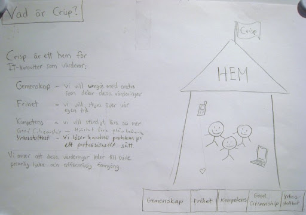

# Crisp in a nutshell

Crisp is an IT consulting company based in Stockholm. But we aren't a very typical consulting company. For example:

* None of the consultants are actually employed by Crisp.
* We have no managers, instead we rely on self-organization and transparancy.
* Our operating model is [open-source](https://github.com/crispab/crisp-model)
* Crisp does not try to earn money from it's consultants. It is in practice a non-profit company (although not formally so). All profit is handed out to the consultants.
* Crisp's main purpose is to enable consultants to be happy, and Crisp Happiness Index is our driving metric.
* Our partnership contract is designed to make our stock financially worthless.
* Consultants can do whatever they want, and work as much or as little as they want.

# The purpose of Crisp

Our purpose is summarized in this A3. 

It hangs on the wall in our office, and we bring it to our conferences so it can be easily updated. Here's an [english translation](../assets/WhatIsCrispA3-en.pdf) of the pic. Summarized below:

    Crisp is a home for IT consultants who value:
    
    * Community - We want to hang out with other people who share our values
    * Freedom - We want to control our own time
    * Competence - We want to continuously learn
    * Good citizenship - Heart over wallet
    * Professionalism - We solve our customers' problems in a professional way
    
    We believe these values lead to personal happiness as well as business success.

# How Crisp works

Our second A3 is called "Crisp strategy" but it's really more about how we operate:

It hangs on the wall next to the other one. Here's an [english translation](../assets/CrispStrategyA3-en.pdf) of the pic. Summarized below:

## What do we measure?

We measure:

* How happy we are (see [Happiness Index](happiness-index.html))
* How happy our customers are. (actually, this point is partly aspirational. Currently our only systemtic customer satisfaction metric is Net Promoter Score for course participants).

## How do we finance the home?

Every Crisper pays a fixed fee per month + % fee of their revenue. The fixed fee is usually around SEK 5000-10000, and the variable fee is usually around 5-12% (TODO: check these numbers). The fee is adjusted every year, based on how much money the company has. If Crisp has significantly less money than it's desired liquidity buffer, the fee is raised, and vice versa. 

.... (work in progress)

Further reading
----------------
See the [What is Crisp](http://blog.crisp.se/2010/05/08/henrikkniberg/1273272420000) blog article. It describes some of the history behind the model.

....

