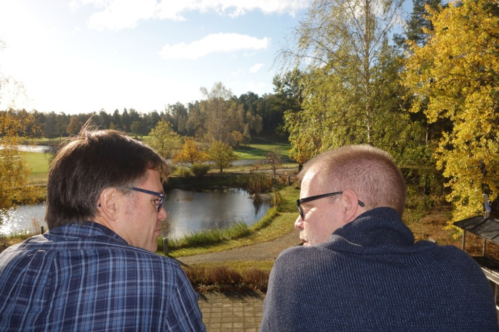
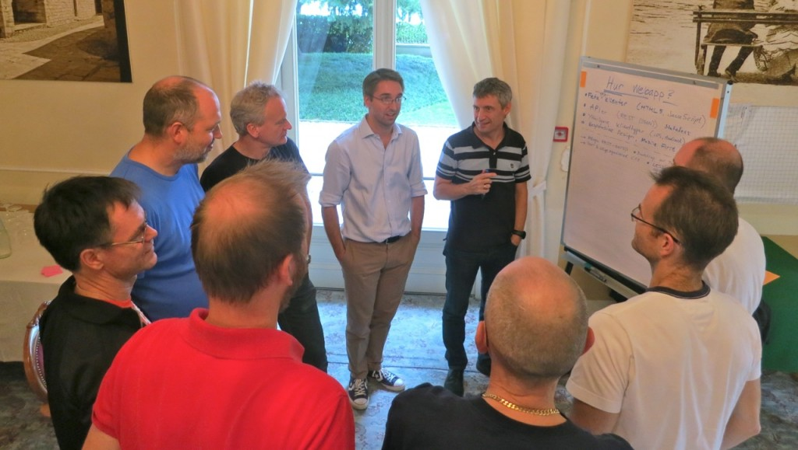
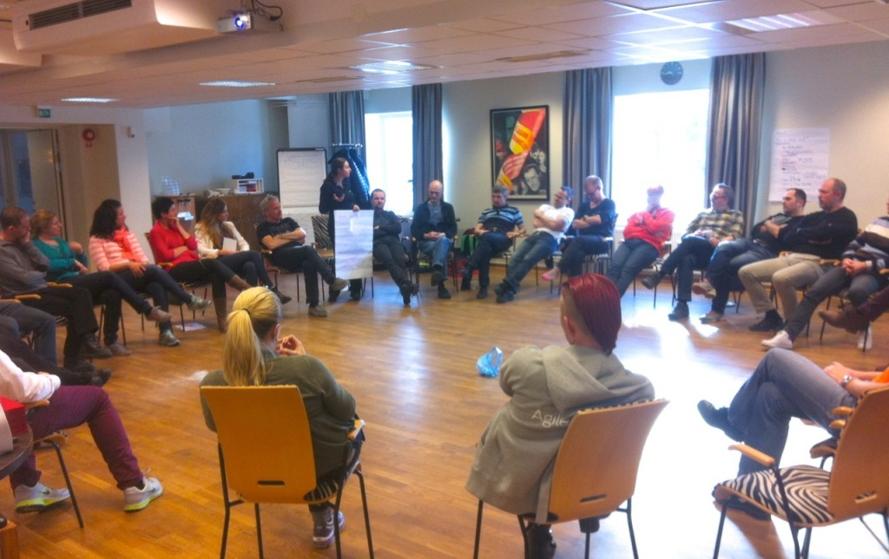

How we make decisions
=====================

How do we make decisions in a decentralized organization with no managers?

Note – for allocation of consultants to client engagements we have a specific protocol for that – the [bun protocol](bun-protocol.html). Similar for recruitment decisions.

Why don’t we have a well defined decision-making process?
---------------------------------------------------------

We make lots of decisions all the time. Which type of coffee machine to buy? Should our internal fees be raised? Where & when is our next Crisp unconference? Which partners should we invite?

Different types of decisions need a different process. It would be crazy to involve the whole team in decisions like which type of whiteboard pens to buy. And it would be crazy to NOT involve the whole team if we needed to move our office to a new location.

So it’s not a good idea to have one single well-defined decision process for everything. And it’s not a good idea to try to list all potential decision types and create a well-defined process for each type, the list would be too long and complex, and there would be too many gray zones.

Well, how do we make decisions then?
------------------------------------

You don’t need a well-defined decision process in order to make decisions. If that was the case, the world would stand still :)

Instead, we follow these principles/guidelines:

-   **The person driving an issue owns the decision process.**
-   **A decision is only a decision if there is a “puller” who follows up on the execution.** (we use the term "driver" and "puller" interchangeably)
-   **Important decisions should be documented in our [decision log](dashboard.html) and emailed to everyone**
-   Some decisions lead to funded “projects”, like our new website. The people involved in something like that form a Crisplet. To get funding, there needs to be two “pullers” throughout the whole project. In practice, we seldom have big projects and rarely need to use this model.

**Example:** If the board is considering to raise the team fee, the board drives that question, and therefore gets to pick the decision process.

**Example:** If I want Crisp to collaborate with company X, then I’m the one driving that question and I pick the decision process.

> **Meta:** So how did we decide on this decision-making process?
> Henrik: "Well, we didn’t. I just noticed that people sometimes ask 'so how do we make decisions' and I started thinking about how it appeared to work, and wrote a wiki page describing it. Then I had a followup meeting to check if this is how we really work, and if this is how we want to continue working, and the answer was pretty much Yes on both counts."

How do I pick a decision process?
---------------------------------

Here are some examples of different decisions processes on a scale from “fast” to “well-anchored”.

-   **Own decision**. Decide yourself without talking to anyone.
-   **Own decision with team input**. Ask for input from the team, but then make the decision yourself.
-   **Own decision with team-anchoring**. Ask for input from the team, suggest a decision, check if the team is OK with it before closing the decision.
-   **Team decision**. Facilitate a decision from the whole team (using consensus, with majority vote as fallback if we can’t reach consensus).

The term “team” in this case really means “those who are affected by the decision”. Sometimes the whole team, sometimes just a few individuals.

These decisions processes can be combined. For example, start by getting input from the whole team, then suggest a decision and anchor with those people who are most directly affected.

For simple decisions, this communication can happen via email or an online poll. For more complex or sensitive decisions, face-to-face conversation is better. We usually do those at our [unconference](unconference.html), using [hand signals](hand-signals.html) to support the conversation and decision process.

Some things to consider when choosing a decisions process:

-   **Who is affected?** Only you? You and a few others? The whole team?
-   **How important is this question to you?** How important is it to those who are affected? Is it a critical decision or trivial one?
-   **Is the decision reversible?** Most decisions are. What is the consequence of making the “wrong” decision, and who is affected by that?
-   **How easy or hard is the decision?** How easy is it to reach consensus with all people affected?
-   **How urgent is the decision?** What is the consequence of delaying the decision, or not making a decision at all?
-   **Who are you?** The decision process may vary depending on your perspective – consultant, board member, office admin, etc. May also depend on how long you’ve been at Crisp (if you are new and unsure you might need to seek more anchoring from people).
-   **Is the outcome affected by laws?** The board of directors in a Swedish company is bound by Swedish laws, so some decisions must be aligned with the board of directors.

Sample decisions:

-   “Should I arrange a free seminar with Lyssa Adkins” =&gt; **Own decision**. Just do it.
-   “Which color should we have on the Crisp cup?” =&gt; **Own decision with team input**.
-   “How often should we do Crisp unconferences?” =&gt; **Own decision with team anchoring**.
-   “Should we divided the company into two business units?” =&gt; **Team decision**.

At the end of the day it’s about balancing risk. If you make the decision yourself it will be fast, but you risk a backlash if others don’t support it. If you seek 100% consensus you may get a better decision with better support, but it could take time – especially for questions where people have opposing opinions.

There is no perfect process, so seek a balance between these extremes! We most often end up in the middle of the scale – “own decision with team input” or “own decision with team anchoring” (where “team” isn’t necessarily the whole team)

What if I still feel unsure of which decision process to use?
-------------------------------------------------------------

Here are some options:

-   **Take a chance!** “Better to ask for forgiveness than permission”. Most decisions are reversible, so you don’t really need to be afraid of making the “wrong” decision or using the “wrong” decision process. Just accept feedback and learn.
-   **Talk to a Crisp colleague**, for example someone who has been around longer and can give examples of what has worked in the past.
-   **Check if someone else can drive** the question for you (or with you). Preferably someone who is strongly engaged in the question. For example if I want next Crisp unconference to be in the Maldives I’d involve the [office team](office-team.html), since they usually arrange our unconferences. It’s nice to pair-drive a decision, so you can always ask on the team mailing list to find a co-driver.
-   **Escalate the decision** to the [board of directors](board.html). For example “hey board, I want to change our recruiting process, how would we make a decision like that?”. We try to minimize the number of decisions that have to be made by the board, but they can give useful input about who needs to be involved.

Our [unconferences](unconference.html) and similar gatherings are a great place to discuss a decision process – and in many cases make the actual decision as well, since everyone is there :)

How decision-making looks like
------------------------------

So, decision making can look like this:

… or like this, for slightly bigger issues:

… or like this, for big issues that affect everyone:

> This was the meeting where we decided to remove the CEO role. For a few years we’d had a rotating CEO role, time-boxed to 30% of full-time. A small group (including the current CEO) discussed the issue during our [unconference](unconference.html), and brought up the concrete proposal to the whole team at the end of the day. A quick consensus check (via [hand signals](hand-signals.html)) and the decision was done! We agreed that the CEO role had fulfilled a purpose, but now the [office team](office-team.html) was capable of dealing with stuff without having a CEO.
> (and what happened to the current CEO? Well, he was happy to be able to drop the role and go back to client-facing work!)

The [open format](unconference.html) of our conference is quite essential to our decision making process, plus the [hand signals](hand-signals.html).
