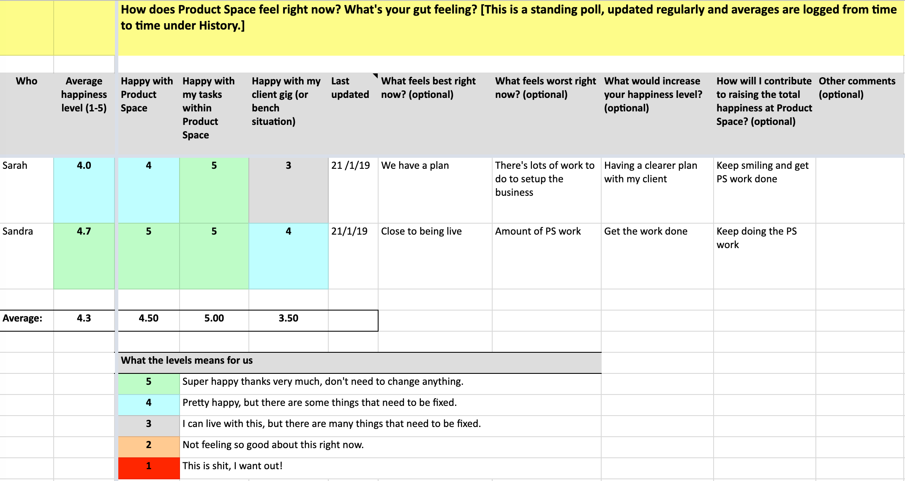
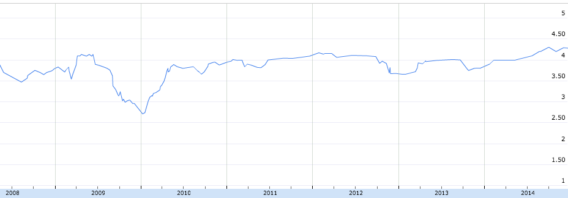

Happiness Index
===============

Our primary metric is “Nöjd Crispare Index” (in english: “Happy Crisper Index” or “Crisp Happiness Index”). It's the only thing we systemically measure and follow up. Scale is 1-5. The data lives in our [dashboard](dashboard.html) (a shared Google spreadsheet).

:https://docs.google.com/a/crisp.se/spreadsheet/ccc?key=0ApEy2bnWDb5fdG1QZzZSeUhFQWJEc2pEdkVDOHkySEE

Here's an [example & template](https://docs.google.com/a/crisp.se/spreadsheet/ccc?key=0ApEy2bnWDb5fdG1QZzZSeUhFQWJEc2pEdkVDOHkySEE), feel free to copy & modify as you see fit.

There's pretty strong peer pressure for people to update this, and most of us do. Some every month, others less frequently. But nobody is forced (remember one of our [core values](what-is-crisp.html) is freedom, so nobody forces anyone to do anything). But all in all this gives us a great overview of what's working and what needs to be fixed.

> Jeff Sutherland saw this and got so excited that he wrote an article called [Happiness Metric - the wave of the future](http://www.scruminc.com/happiness-metric-wave-of-future) and now [teaches webinars](http://www.scruminc.com/happiness_metric/) on it and talks about it all over the world. Cool :o)

Survey questions
----------------

The 3 main questions in the survey are:

-   **How happy are you with being at Crisp**? This is the main overarching happiness index.
-   **How happy are you with your tasks in Crisp**? This means internal work such as board meetings, conference facilitation, or creating this Crisp DNA site. This is especially relevant for our [office team](office-team.html), who do most internal work and have no external clients of their own.
-   **How happy are you with your current client, or your bench situation?** We measure this separately, because sometimes a person could be really happy with Crisp, but sad about the current client. Or vice versa. For people who are on the bench (= no client at the moment), this can express how they feel about that (sometimes people WANT to be on the bench).

The scale is:

-   5 = Super-happy! Don't want to change anything!
-   4 = Pretty happy, but there are some things that need to be fixed.
-   3 = I can live with this, but there are many things that need to be fixed.
-   2 = Not feeling so good about this right now.
-   1 = This is crap! I want out.

> NOTE: If you copy this survey, remember that you can of course make it anonymous. We chose to make it non-anonymous because we have a pretty high-trust culture and people are pretty uninhibited about expressing their thoughts and opinions.

We also have a "last updated" column where people enter the date as they update their numbers. When many entries start looking old (as in &gt; 2 months) then we'll usually start nagging each other to update it. Especially a few days before a conference or board meeting, since we use the happiness data to generate insights and trigger actions.

We have a few additional text columns as well, to gather further info. They are all optional.

-   What feels best right now?
-   What feels worst right now?
-   What would increase your happiness level?
-   How will I contribute to raising the overall happiness level?
-   Other comments.

It's very interesting to read what people write!

> Sometimes we get cascading effects - for example Joe is pissed off about something, and other people are sad because Joe is upset, so all numbers go down. That's good though! The problem is now highly visible and measurable, so we're more likely to fix it.

How we use the happiness data
-----------------------------

The happiness index is used as key artifact during [board meetings](board.html), and we also print it out and bring to our [bi-annual unconference](unconference.html).

Whenever the average changes significantly, we talk about why, and what we can do to make everybody happier. If we see a 1 or 2 on any row, that acts as an effective call for help. People go out of their way to find out how they can help that person, which often results in some kind of process improvement in the company.

> For example, once somebody dropped to a 1 due to confusion and frustration with our internal invoicing routines. Within a week we did a workshop and figured out a better process. The company improved and the Crisp Happiness Index increased.

Crisp Happiness Index is more important than any financial metric, not only because it visualizes the aspect that matters most to us, but also because it is a leading indicator, which makes us more agile. Most financial metrics are trailing indicators, making it hard to react to change in time.

Happiness history
-----------------

We use a separate [history worksheet](https://docs.google.com/a/crisp.se/spreadsheet/ccc?key=0ApEy2bnWDb5fdG1QZzZSeUhFQWJEc2pEdkVDOHkySEE#gid=3) to show how the average happiness changes over time, and how it correlates to specific events. We update the history manually - from time to time someone simply copies the average happiness values and adds to the history table, and the history chart gets updated.

Here's our actual happiness history 2008-2014:

Very useful to spot trends! We're usually around 4, our all-time low is 2.7 (a temporary dip in early 2010 when we had a bad conflict), and our all-time high is 4.3 (late 2014)
