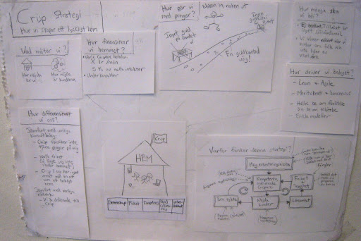
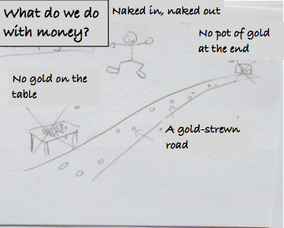

How Crisp works
===============

Our second A3 is called "Crisp strategy" but it's really more about how we operate:

It hangs on the wall next to the [What is Crisp](what-is-crisp.html) A3. Here's an [english translation](../assets/CrispStrategyA3-en.pdf) of the pic. Summarized below:

What do we measure?
-------------------

We measure:

-   How happy we are (see [Happiness Index](happiness-index.html))
-   How happy our customers are. (actually, this point is partly aspirational. Currently our only systematic customer satisfaction metric is [Net Promoter Score](http://en.wikipedia.org/wiki/Net_Promoter) for course participants).

How do we finance the home?
---------------------------

To cover our costs, every Crisper pays a fixed fee per month + % fee of their revenue. The fixed fee is usually around SEK 3500-5000, and the variable fee is usually around 8-12%. The fee is intended only to cover Crisp's costs, so we adjust it every quarter based on how much money we have in our coffers. If we have less than our desired liquidity buffer then we raise the fees, and vice versa.

> **Why a fixed + variable fee?** If we only had a fixed fee, consultants on the bench would quickly run out of money. And if we had only a variable fee, we might have trouble covering our fixed costs if many consultants are on the bench. With a fixed + variable fee, we get a nice balance that matches the fact that our costs are also fixed + variable. It is also typical Sveeedish to pick a model that is [lagom](https://en.wikipedia.org/wiki/Lagom) - as in, nobody is totally happy and nobody is totally disappointed ;-)

We also have a ceiling, to limit the total fee a consultant pays to Crisp per year (variable + fixed). Some consultants earn a lot more than others and we don't want them to leave just because Crisp gets too expensive. The ceiling is usually around kSEK 250-300 per year.

See [Economic model](economic-model.html) for concrete examples.

What do we do with the money?
-----------------------------

This picture sums it up:

The guiding principles are:

-   **Naked in, Naked out** - you don't need to put in serious cash to join Crisp, and there's nothing to cash out when you leave.
-   **No gold on the table** - we don't try to build financial value in the company.
-   **No pot of gold at that end** - there's no financial incentive to sell the company.
-   **A gold-strewn road** - you keep most of what you earn, as you earn it.

> **Why don't we try to build financial value?** If Crisp has a big pile of money, that creates a financial incentive to own the company, and increases the risk of conflict as the "value" of the company goes up and down. If we keep the company lean, with only a small liquidity buffer, then we don't need to argue about who owns what.

See [Economic model](economic-model.html) and [Ownership model](ownership-model.html) for more details on how money flows through the system.

How many do we want to be?
--------------------------

-   We don't have a growth target. Growth is not a goal in itself.
-   We grow only when we find awesome people and aren't suffering from growth pain.

For more see [Recruiting](recruiting.html).

How do we run the company?
--------------------------

-   **Lean & Agile** - our approach is based on lean and [agile](http://agilemanifesto.org) principles.
-   **Meritocracy & Consensus** - we don't have titles, managers, or reporting structures. Instead we are a [meritocracy](http://en.wikipedia.org/wiki/Meritocracy), which basically means your power to influence stuff is based on your competence and engagement. Decisions are made mostly using consensus ([here's how](decisions.html)).
-   **Ask for forgiveness rather than permission** - if you want to start or change something, go ahead! The default answer to any request or idea is "Sure! If you believe in it and want to put time into it!". Very few mistakes are fatal or irreversible, so we encourage each other to just try things rather than seek permission.
-   **Simple models** - being a bunch of smart engineers and process nerds, we can come up with detailed rules and structures for any kind problem. But we really try not to! We don't want to overcomplicate things, and prefer to err on the side of simplicity. Better to have too few rules than too many, and better to follow high level guiding principles than low level detailed procedures.

For more info, see [How we make decisions](decisions.html).

How do we differentiate?
------------------------

How are we different from a typical consulting company?

-   Crisp is not trying to earn money from its consultants
-   100% freedom for all consultants (as long as they don't hurt the home)
-   Crisp has no other goal than to provide a happy home

How are we different from a typical network of independents?

-   We are dedicated to Crisp - that is, consultants are expected to do all their work and invoicing through Crisp.

Why does this strategy work?
----------------------------

Although this is part of the A3, it's really a separate topic: [Why this model works](why-this-works.html)

Further reading
---------------

See the [What is Crisp](http://blog.crisp.se/2010/05/08/henrikkniberg/1273272420000) blog article. It describes some of the history behind the model.
