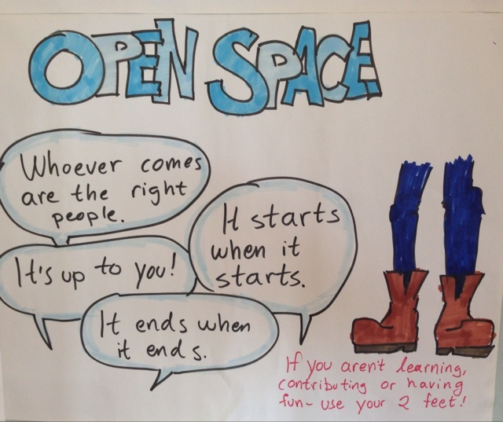
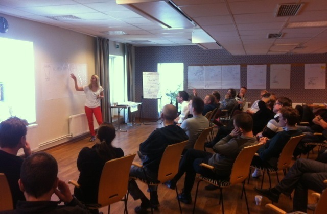
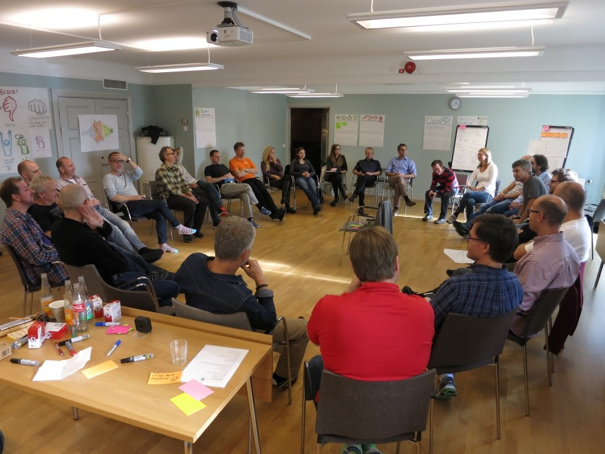
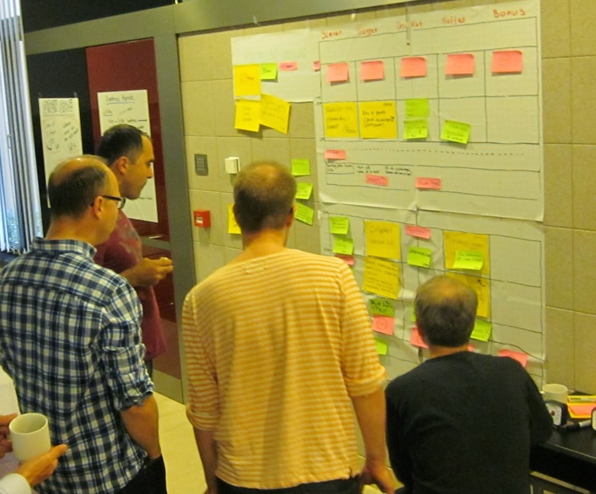
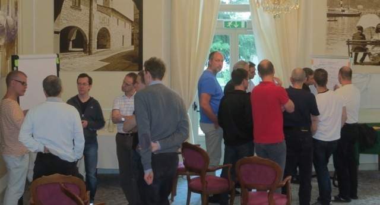
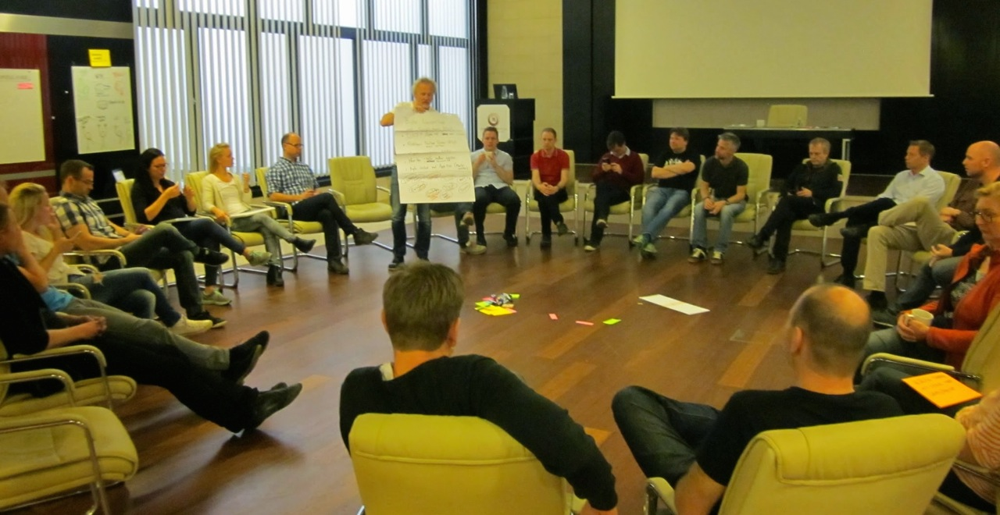

Crisp Unconference
==================

Twice per year we do an internal unconference, in Sweden or abroad.

An unconference is like a normal conference but with no predefined agenda, no predefined list of speakers, no slides, and… er… actually it’s not very much like a normal conference at all! It’s more like an alternative to a conference. If the purpose of a conference is to collaborate and communicate, then an unconference will often fulfill the same purpose in a more simple, fun, and effective way!

> For details, check the ebook [How to run an internal conference](https://leanpub.com/unconference) or [these slides](https://dl.dropboxusercontent.com/u/1018963/Projects/2013-06-18%20Agile%20Evening/HowToRunAnUnconference.pdf) which summarize it.

Why we do conferences
---------------------

Face-to-face is the most effective way to get to know each other, spread knowledge, solve problems, and make decisions. Unfortunately, since we are consultants and work with different clients, we rarely naturally meet as a big group. So that's the purpose of the unconference - to get everyone together!

Through experimentation we've learned that twice per year is frequent enough to deal with important topics before things get out of hand, and seldom enough for the travel cost & coordination overhead to be palatable.

Where do we go?
---------------

Varies. We normally alternate between a small local trips (2 days at a venue near Stockholm), followed by a bigger international trip (4 days in some interesting European city, like Barcelona or Rome or Istanbul).

Does everyone have to attend?
-----------------------------

More or less, yes. We haven't made it a formal rule, but implicitly people are expected to attend "most" conferences (sometimes Life gets in the way of course). This is our most important team activity, and all high-impact decisions happen there. We also get to know each other better, build trust, trade knowledge, and have lots of fun!

Basically, the conference is where the Crisp DNA strengthens and evolves!

The conference cost (travel, hotel, etc) is split evenly between all consultants, whether or not you attend. That way there's not much economic incentive to skip the conference (as in "I'm a bit low on cash now, so I'm skipping the conference"). You pay either way so you might as well attend :)

In practice attendance has not been a problem so far. We usually have at least 90% of the company there, and our surveys show that people appreciate the conferences. Also, our [happiness index](happiness-index.html) usually makes a small jump up after each conference (since we often solve some of the pain points that the happiness survey revealed).

Guiding principles
------------------

Most of our conference is based on the [Open Space](http://en.wikipedia.org/wiki/Open_Space_Technology) format.

That means the only real rule is the **Law of 2 feet**. Our version of it is: **"if you aren't contributing or learning or having fun where you stand now, use your two feet (and go somewhere where you can contribute or learn or have fun)!"**

Other guiding principles (we vary them a bit, but this should give you the general idea):

-   **Whoever comes are the right people.**
    -   You can influence people, but not control them. The people who decided to come to your session are the right people, because they chose to come. What if nobody shows up? Don’t worry. How often do you get time to really sit down and reflect on a topic? Take the chance! And maybe people will show up after a while. Or you simply use the law of 2 feet and go somewhere else.
-   **It's up to you.**
    -   If you want something to happen, or a topic to come up, or a decision to be made, do something about it. Don’t expect someone else to do it for you.
-   **Whatever happens is the only thing that could have.**
    -   Prepare to be surprised! Things rarely turn out as expected, so there’s no point in fretting over what should have happened or might have happened. Take each moment as it comes, and make the best of it.
-   **It's over when it's over.**
    -   We have time slots, but a conversation doesn't have to be exactly that long, not does it have to stay on topic. Maybe you run out of steam, or reach a great conclusion after just 20 minutes. Or maybe you want to continue this topic for another hour! That’s fine, although in that case you might want to move your group out of the way, to make space for the next group.

What's the conference format?
-----------------------------

Normally 2 days of conferencing with a break in the middle. For the shorter trips, the break is usually an afternoon or evening of activities and relaxing. For the longer trips, it's usually a full day of touristy stuff.

> The break in the middle is very important. Quite often some hairy complicated issue is uncovered on day 1, then day 2 people are chatting about while doing touristy things, and over dinner, and sleeping on it, etc. Then on day 3 we get back together and have lots of ideas and insights, and can make good decisions!

Here's a summary of what we typically do on a conference day:

### 1. Do some lightning talks, or short team-building activities to get everyone inspired

### 2. Present the format and Brainstorm topics

Gather everyone in a ring. Present the open space format & today's theme (sometimes we have a theme, sometimes not). Show the empty schedule grid, and ask people to suggest topics and write on stickies.

### 3. Create a schedule

Ask the people who suggested topics to organize them into the schedule grid. Left-to-right are all the locations in the room, and up-to-down are all the time slots (usually 30-60 minutes each). And a small section to capture "mini-topics" for when we all gather at the end.

### 4. Breakouts!

Now everyone knows approximately what's happening when & where! The schedule is a guide, not a hard constraint. Lots of other interesting and unplanned topics are going to pop up here and there. Let people self-organize for the next few hours, using the Law of 2 Feet. Make sure there is plenty of snacks, fruit, coffee & drink around.

### 5. Gather up for summaries and decisions

One hour before the end, gather everyone back into the ring. For each topic, ask someone to do a 2 minute summary of what came out. Collect key decisions/actions on the wall. Ask if anyone else has anything to say, or if there are any decisions that need to be made while we are all gathered.

We have a [consensus-based decision model](decisions.html) and make diligent use of [hand signals](hand-signals.html).

Finally we wrap up by asking people to share their key take-aways from the day.

Sample schedule
---------------

Our larger unconferences usually look something like this:

-   **Friday** = arrival day (fly in, check in to hotel, have a look around, etc)
-   **Saturday** = conference day 1
-   **Sunday** = touring day
-   **Monday** = conference day 2 & flight home

... and a typical conference day:

-   9:00 - 9:45: Gather up and do some lightning talks or energizing activities (like improv)
-   9:40 - 10:30 Generate topics and a high-level schedule matrix
-   10:30 - 16:00 Breakout discussions (including lunch)
-   16:00 - 17:00 Gather up and do summaries, decisions, and the like.

Who organizes and facilitates the conference?
---------------------------------------------

The [office team](office-team.html) organize the trip itself (flight, hotel, venue, food, etc). The conference days are facilitated by a pair of Crisp consultants. Usually we rotate one person after every conference - the goal is that each conference should have one facilitator from last conference, and one that is new. That way the facilitator pair has experience from last conference, but also some new insights.

> We're lucky in that many Crispers work as coaches and have lots of facilitation experience. Of course, the downside is that it's sometimes challenging to facilitate other experienced facilitators! We sometimes slip into meta-discussions about how we should do stuff, rather than just doing it :)

Sometimes we bring an external guest to do a talk or facilitate some specific topic in the conference.

Why do we use this format?
--------------------------

Key benefits (compared to a more traditional conference structure):

-   **Higher energy level.** People focus on issues that matter to them.
-   **Less up-front planning.** No need for someone to set up a detailed agenda ahead of time.
-   **More flexibility.** Once we have everyone together, we may discover unexpected topics that are of great interest and importance. With a dynamic agenda, we can capture the moment and maximize the value of the conference.
-   **Spontaneous conversations.** Often the most valuable parts of a conference are the informal conversations that happen between people in different teams or roles, who don't normally work together. The open space format encourages this.
-   **It works as a quality/interest filter.** Lets assume you are all fired up about something new, say Bitcoin, and want the whole company to join you in some Bitcoin effort. During the brainstorming phase, you suggest a Bitcoin topic and it gets added to the schedule. When it is time time for your Bitcoin session, what if only you show up? Well, now you know, with some certainty, and in a really visual and awkward way, that no one else really share your enthusiasm for Bitcoin. Shit happens. Life goes on. Use your two feet and go somewhere else where there's action! :-)

We sometimes try other (less open) formats, and it's good to vary a bit. But we keep gravitating back to the open-space format, because the law of 2 feet is just such a powerful thing!
