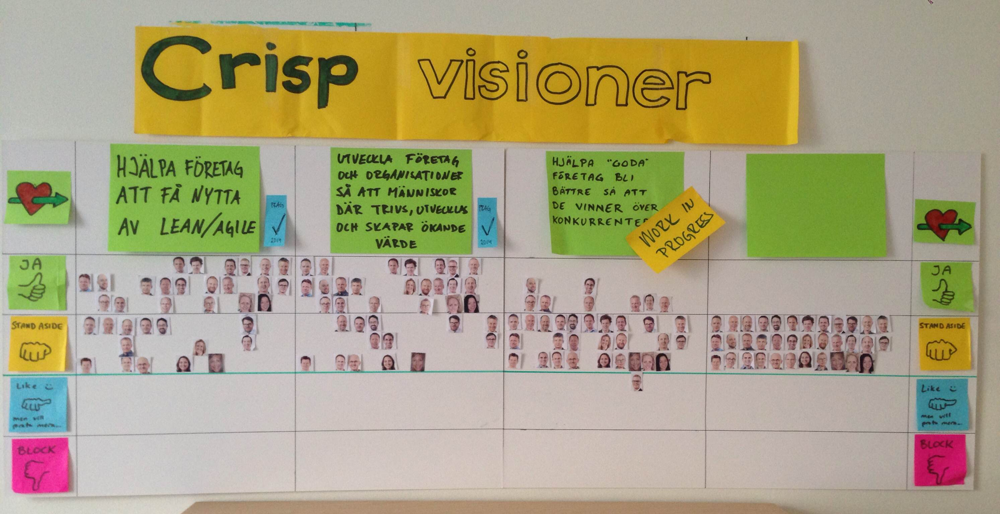

Visions
=======

One big aha in our evolution was when we [realized](http://blog.crisp.se/2010/05/08/henrikkniberg/1273272420000) that Crisp itself is just a platform. Crisp doesn't have a Vision (with a Big V), we just want Crisp to be a [nice home for consultants](what-is-crisp.html).

However, many of the *people* at Crisp do have a vision. Here are the most widely shared visions:

**Vision 1: "Help companies benefit from Lean/Agile"**

**Vision 2: "Develop companies and organizations so the people there can be happy, improve, and create increasing value."**

PS: that doesn't mean we're all coaches. In fact, most of us are developers. See [our business](our-business.html).

Why do we have multiple visions?
--------------------------------

Because people don't all have to want the same thing. We're in this home together because we have a common set of values, not because we have to have the same vision and goals. People can work on whatever they are passionate about, and if enough other Crispers share the same passion it implicitly becomes a Crisp vision.

How we work with visions
------------------------

We're guided by these principles (which we agreed upon on one of our [unconferences](unconference.html)):

-   Crisp can have several visions.
-   They can and should only be changed at our unconferences, so everyone can discuss.
-   The visions apply between the unconferences.
-   If you miss an unconference, you are automatically considered to "stand aside" (see our [hand signals](hand-signals.html)).

Here is how we decided on these two particular missions:

It was a standing vote, where people could move their avatars to show their stance on each of the suggested vision statements. As discussion happened and the statements were improved, people moved their avatars around. Gradually we reached strong consensus on two of them (and almost on a third one).

Two more principles:

-   It's OK to move your avatar up and down even between conferences (the poster is on the wall in our office). But that will be considered input to the next conference, no decision will be made directly.
-   We bring this poster to our conferences, so we keep iterating on it (just like our two A3s [What is Crisp](what-is-crisp.html) and [How we work](how-crisp-works.html)).

Does everyone have to agree with these visions?
-----------------------------------------------

No. In fact, if you look at the photo above, at least 10 people voted "stand aside" for both visions. That means they are fine with that vision, but personally have other priorities. And that's perfectly fine.
